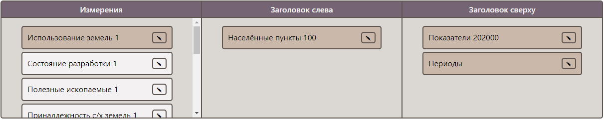
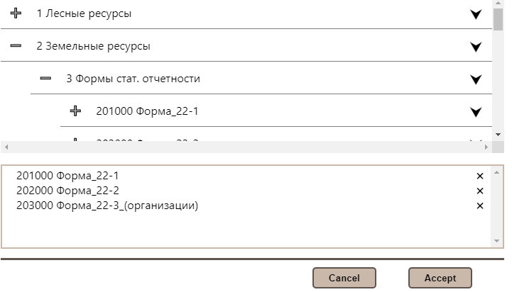
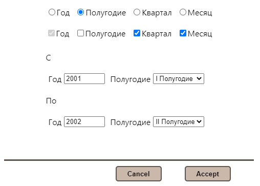
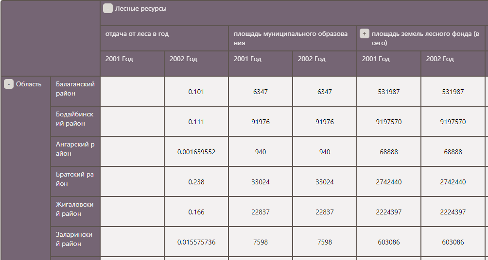

## OLAP Client

Клиентская часть веб-версии системы MDAttr с использованием React и [react-beautiful-dnd](https://github.com/atlassian/react-beautiful-dnd).

#### Панели выбора измерений

#### Окно выбора значений измерений

#### Выбор периодов

#### Таблица значений

